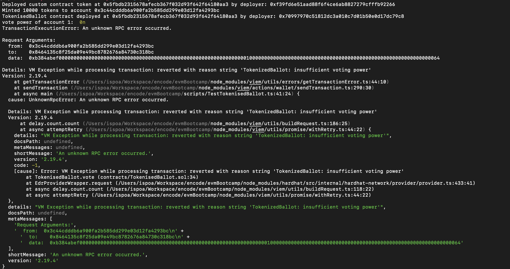
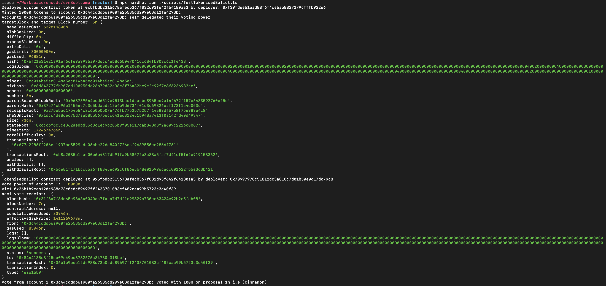
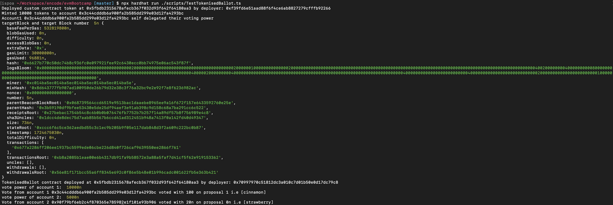
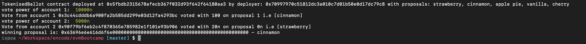

# evmBootcamp
Repository for Encode EVM Bootcamp Submissions


```shell
npm run compile
npx hardhat run ./scripts/TestMyToken.ts

npx hardhat run ./scripts/TestTokenisedBallot.ts
```

## Should fail if account doesnt have sufficient votes
Script fails as expected when user attempts to vote without enough voting power.
  

## Should allow to vote when account has sufficient voting power
We can successfully vote if user has enough voting power.


## Should allow another user vote
We can successfully vote with another user.


## Should get winning proposal
We can get winning proposal

