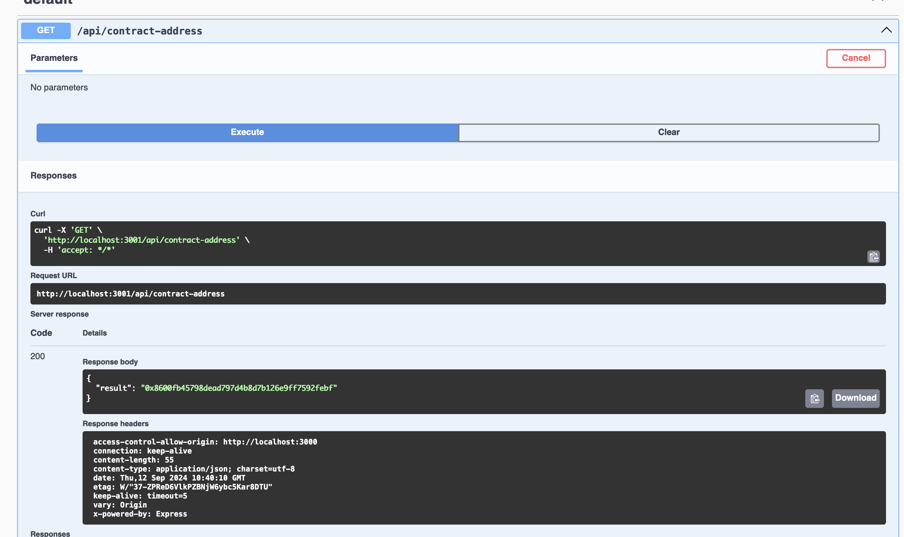

### Week 4 challenge, connecting a frontend to a backend

Contracts deployed:
Token contract [https://sepolia.etherscan.io/address/0x8600fb45798dead797d4b8d7b126e9ff7592febf](address)

Tokenised Ballot contract [https://sepolia.etherscan.io/address/0x4e55a42b7da905f9e46347d7b0850200f2a1e36d](address)

Run server, run frontend(dApp)

